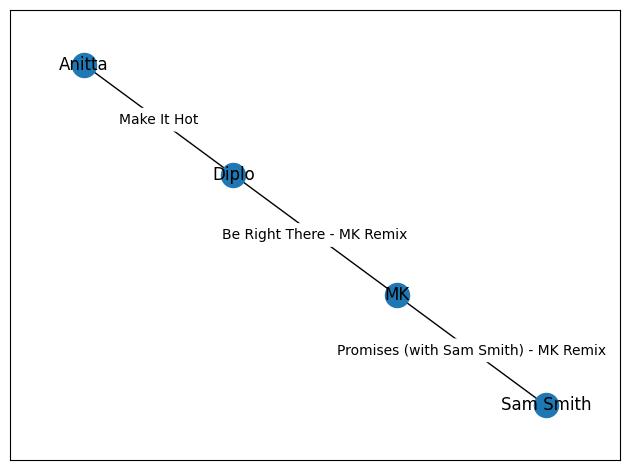
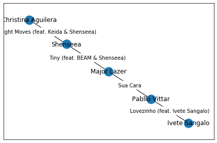

# Colaborações Musicais

**Número da Lista**: 9 
**Conteúdo da Disciplina**: Grafos 1 

## Alunos
|Matrícula | Aluno |
| -- | -- |
| 16/0141842  |  Philipe Rosa Serafim |
| 16/0143403  |  Renan Welz Schadt |

## Sobre
O objetivo do trabalho foi por em prática os conceitos aprendidos durante o módulo 1 da disciplina de Projeto de Algorítimos, onde foi implementado um algoritmo de busca em grafos para encontrar o menor caminho entre dois nós.

Num primeiro momento foi necessário realizar uma filtragem a partir da base de dados escolhida, considerando apenas as músicas com mais de 1.2 milhões de streams e lançadas entre os anos de 2010 e 2020 na plataforma Spotify. Tendo posse das músicas e artistas no formato que foi definido pela dupla, foi iniciada a implementação da estrutura do Grafo.

Foi utilizada uma classe para definir o grafo e as funções utilizadas, principalmente a *BFS_shortest_path()*, que é responsável por encontrar o menor caminho entre dois nós, após obtermos sucesso na implementação, evoluímos o algoritmo para que ele pudesse retornar os três menores caminhos entre dois nós, considerando o número de colaborações entre os artistas.

Por último, foi utilizado a implementação de grafos de uma biblioteca externa, a NetworkX, para que fosse possível ilustrar os resultados obtidos com o algoritmo implementado.

## Screenshots

## Instalação 
**Linguagem**: Python3 
**Framework**: Jupyter Notebook 

### Como rodar
 - Instalar e configurar o Python3/Pip3
 - Primeiro deve-se clonar o repositório
 - Tendo clonado o repositório deve-se entrar na pasta do projeto e então rodar o comando `pip install -r requirements.txt`.
 O pip install irá instalar todas as bibliotecas necessárias para rodar o projeto, inclusive o *Jupyter* e o *Notebook*, caso isso não ocorra como esperado, deve-se instalar manualmente.
  - Após a instalação das bibliotecas, deve-se rodar o comando `jupyter notebook` para abrir o notebook.
  - O arquivo do projeto está localizado em `src\shortest_path_bfs.ipynb`

## Uso 

Para utilizar basta clicar no *Run all* do próprio *jupyter*, caso deseje alterar os nós de origem e destino, basta alterar os parâmetros dentro da função *BFS_shortest_path()*. É necessário que os nomes escritos estejam corretos, caso contrário o algoritmo não irá encontrar o nó desejado.

